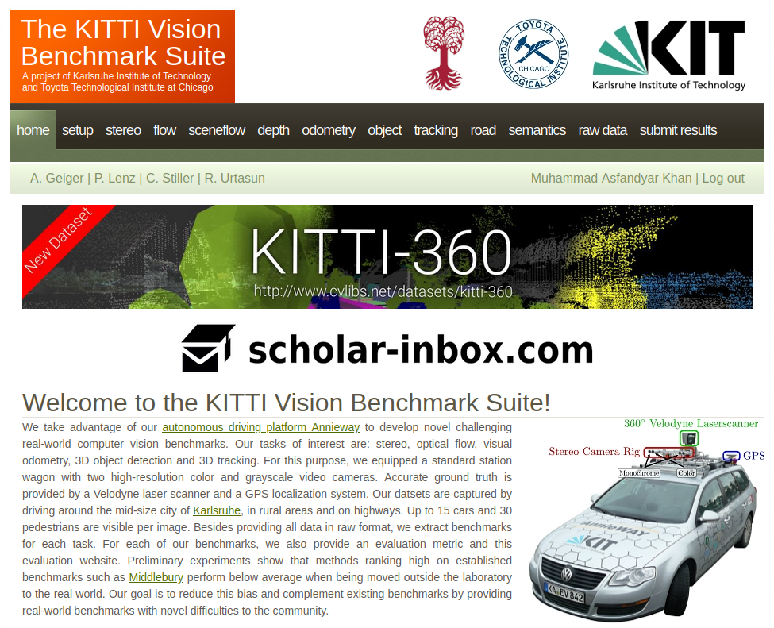
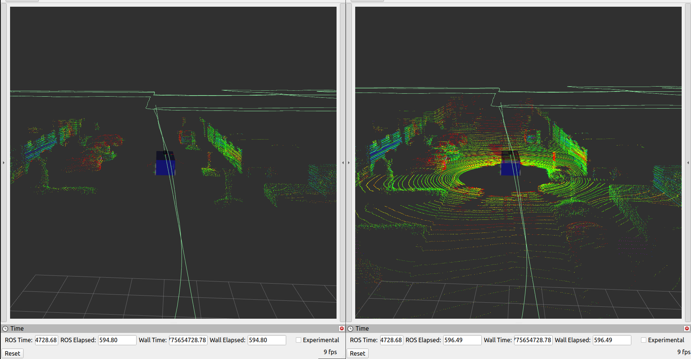
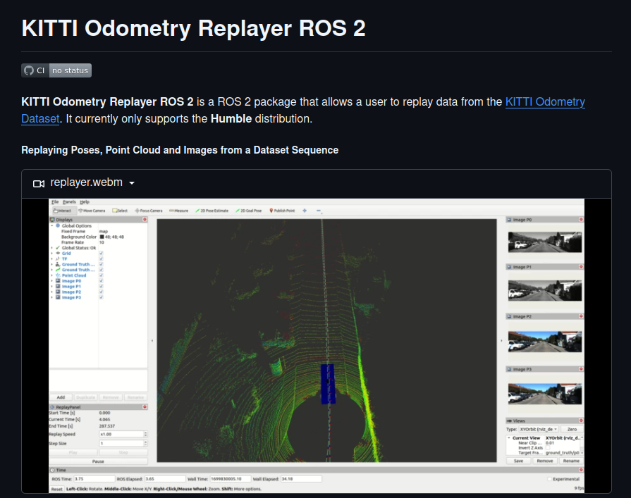

# ROS2 C++ Sensor Fusion Mini-Stack for Autonomous Driving

## Objective

This repository is a ROS2 C++ autonomous driving mini-stack built around KITTI replay.

The goal is to build a compact, readable portfolio project that demonstrates:

- ROS2 node/package architecture
- modern C++ ownership and pipeline design
- LiDAR and camera ingestion from KITTI replay
- object-level fusion and tracking
- behavior-level output such as `GO`, `SLOW`, `STOP`

## Current Status

The project currently has:

- a custom `lidar_processing` node that:
  - subscribes to replayed LiDAR data
  - crops the ROI
  - voxelizes the cloud
  - optionally removes the ground plane with RANSAC
  - publishes a processed LiDAR point cloud
- a custom `camera_processing` node that:
  - subscribes to replayed monocular camera data
  - runs ONNX Runtime-based YOLO inference
  - publishes `vision_msgs/Detection2DArray`
  - can optionally publish an overlay image for visual debugging
- KITTI replay infrastructure from the `ros2_kitti_*` packages
- URDF/TF and RViz visualization support
- optional odometry integration from the `ros2_kitti` stack

Still in progress:

- fusion/tracking
- behavior decision output
- tests/CI beyond the current helper scripts and existing upstream tests

## Repo Organization

This repo contains two kinds of packages.

My project-specific work in this repository is focused on the custom processing and fusion layer, including packages such as:

- `lidar_processing`
- `camera_processing`
- `fusion_core`
- `visualization`

### Integrated / upstream-style infrastructure

These provide the replay, TF, description, RViz, and odometry base:

- `ros2_kitti_core`
- `ros2_kitti_replay`
- `ros2_kitti_description`
- `ros2_kitti_msgs`
- `ros2_kitti_odom`
- `ros2_kitti_odom_kiss_icp`
- `ros2_kitti_odom_open3d`
- `ros2_kitti_rviz_plugin`

I treat these packages as the infrastructure layer rather than the main portfolio focus.

### Custom project packages

These are the packages where the project-specific work is being implemented:

- `lidar_processing`
- `camera_processing`
- `fusion_core`
- `replay_adapter`
- `visualization`

Current custom progress:

- `lidar_processing`: active and working
- `camera_processing`: active and publishing detections
- `visualization`: owns app-level bringup launch
- `fusion_core`: early scaffold
- `replay_adapter`: not required yet

## Camera Processing

The camera-side perception layer is implemented as a custom `camera_processing` package rather than a direct wrapper around an external detector repository.

Current implementation:

- uses a single monocular camera input, currently `p2_img`
- keeps the first version monocular rather than stereo
- handles image subscription, preprocessing, and camera-side detection in ROS2/C++
- publish `vision_msgs/Detection2DArray` for downstream fusion
- can optionally publish an overlay image with rendered detections for RViz debugging

This keeps the camera stack aligned with the rest of the project:

- `lidar_processing` owns LiDAR-side preprocessing
- `camera_processing` owns camera-side preprocessing and 2D detections
- `fusion_core` will own cross-sensor fusion, tracking, and decision logic

## Current Pipeline

Current end-to-end flow:

`KITTI replay -> /lidar_pc -> lidar_processing -> /processed_lidar_pc`

`KITTI replay -> /p2_img -> camera_processing -> /object_detections`

Planned later flow:

`KITTI replay -> camera + lidar -> processing -> fusion/tracking -> decision -> visualization`

## What KITTI Provides vs What This Repo Adds

### Raw KITTI provides

- timestamps
- LiDAR scans
- camera images
- calibration
- pose / ground-truth trajectory for supported odometry sequences

Dataset reference:

- KITTI Odometry Dataset
- https://www.cvlibs.net/datasets/kitti/eval_odometry.php



### This repo adds

- ROS2 topics and message publishing
- frame IDs and timestamps on messages
- TF tree and URDF loading
- replay controls and RViz integration
- custom LiDAR preprocessing node
- custom camera detection node
- custom stack message package for fused/tracked outputs

## LiDAR Processing Node

The `lidar_processing` node currently performs:

1. latest-message buffering outside the callback
2. ROS `PointCloud2` to PCL conversion
3. ROI crop with `pcl::CropBox`
4. voxel downsampling with `pcl::VoxelGrid`
5. optional ground removal with `pcl::SACSegmentation` and `pcl::ExtractIndices`
6. publication of `/processed_lidar_pc`

Current configurable parameters:

- `processing_rate`
- `crop_box_min`
- `crop_box_max`
- `voxel_leaf_size`
- `enable_ground_segmentation`

These are configured in the app bringup launch:

- [av_stack_bringup.launch.py](/home/asfy/projects/covolv/ros2_av_stack_cpp/src/visualization/launch/av_stack_bringup.launch.py)

## Camera Processing Node

The `camera_processing` node currently performs:

1. latest-message buffering outside the callback
2. ROS `sensor_msgs/Image` to OpenCV conversion with `cv_bridge`
3. ONNX Runtime-based YOLO inference
4. publication of `vision_msgs/Detection2DArray`
5. optional publication of an overlay image for debugging in RViz2

Current configurable parameters:

- `processing_rate`
- `model_path`
- `publish_overlay_image`

Current camera topics of interest:

- `/p2_img`
- `/object_detections`
- overlay image topic when enabled

## LiDAR Processing Visuals

Current before/after visualization for the preprocessing stage:

- raw replayed LiDAR point cloud on `/lidar_pc`
- processed LiDAR point cloud on `/processed_lidar_pc`
- side-by-side comparison showing the effect of ROI cropping, voxelization, and optional ground removal



This should make the `lidar_processing` package easier to evaluate as a standalone perception module.

## TF / URDF / Timestamp Notes

For later fusion work, the important message fields are:

- `header.stamp`
- `header.frame_id`

In the current replay stack:

- `header.stamp` comes from KITTI `times.txt`
- LiDAR `header.frame_id` is set by the replay node to a prefixed LiDAR frame
- camera `header.frame_id` is set by the replay node to prefixed camera frames such as `p2`
- URDF + `robot_state_publisher` define the fixed sensor geometry
- replay / odometry nodes provide motion transforms over time

This is the basis for future sensor alignment and fusion.

## Running The Current Stack

Build:

```bash
colcon build --packages-select auto_stack_msgs lidar_processing camera_processing visualization
source install/setup.bash
```

Launch:

```bash
ros2 launch visualization av_stack_bringup.launch.py dataset_path:=/path/to/kitti_dataset dataset_number:=0
```

Current LiDAR topics of interest:

- `/lidar_pc`
- `/processed_lidar_pc`

Current camera topics of interest:

- `/p2_img`
- `/object_detections`

## Attribution

This project builds on and integrates the `ros2_kitti_*` replay/visualization stack from:

- `tengfoonglam/kitti_odometry_replayer_ros2`
- https://github.com/tengfoonglam/kitti_odometry_replayer_ros2

This repository uses that upstream project for the KITTI replay, URDF/TF, RViz, message, and odometry infrastructure.



## Development Notes

- I use `ros2_kitti_*` as the base/integration layer
- I add custom work on top of that layer rather than deeply refactoring the upstream stack
- the main app entrypoint is the custom bringup launch in `visualization`

## Roadmap

- [x] Integrate KITTI replay and visualization infrastructure
- [x] Add custom LiDAR preprocessing node
- [x] Add LiDAR preprocessing parameters in bringup
- [x] Add a basic LiDAR raw-vs-processed comparison script
- [x] Capture and document LiDAR preprocessing visuals
- [x] Add camera processing node
- [x] Add ONNX-based 2D camera detections
- [x] Separate custom stack messages into `auto_stack_msgs`
- [ ] Add optional camera overlay visualization for RViz2
- [ ] Benchmark camera and LiDAR runtime stage-by-stage
- [ ] Decide and document the v1 fusion strategy
- [ ] Implement fusion and tracking in `fusion_core`
- [ ] Publish tracked object outputs
- [ ] Publish decision output such as `GO`, `SLOW`, `STOP`
- [ ] Evaluate LiDAR-side clustering/detection vs fusion on current outputs
- [ ] Fine-tune the YOLO model for autonomous-driving-relevant classes
- [ ] Improve automated tests
- [ ] Add CI and polish documentation
