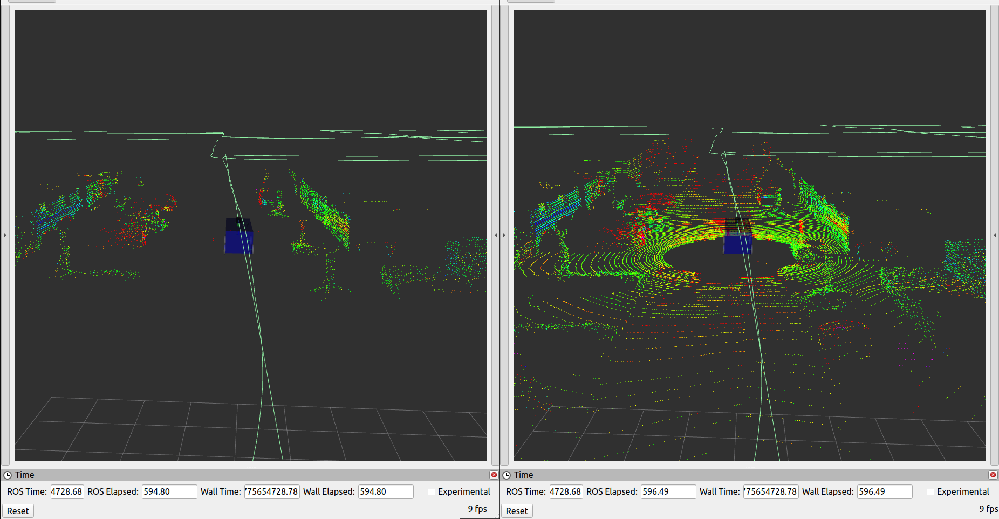
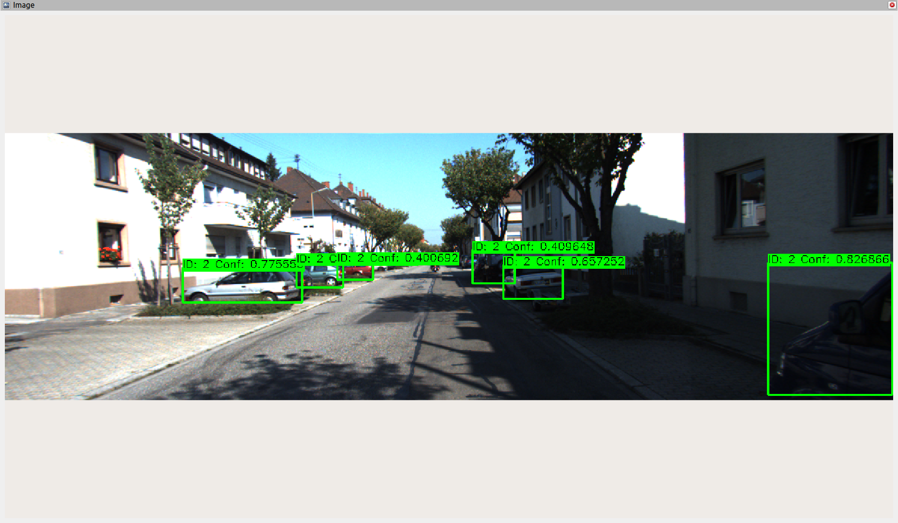

# ROS2 C++ Perception And Sensor Fusion Mini-Stack

This repository is a ROS2 C++ autonomous driving mini-stack built around KITTI replay.

The project focuses on a compact perception pipeline:

- `lidar_processing` for LiDAR-side preprocessing and 3D object proposals
- `camera_processing` for monocular YOLO detections and optional `CameraInfo`
- `tracking_based_fusion` in `fusion_core` for map-frame LiDAR tracking, camera validation, and fused outputs
- `visualization` for app-level bringup

The current stack already produces visible intermediate results from both sensing paths:

- LiDAR preprocessing and 3D proposal extraction:



- camera detections on the monocular image stream:



Current public stack outputs:

- `/tracked_objects` via `auto_stack_msgs/TrackedObjectArray`
- `/decision_state` via `auto_stack_msgs/DecisionState`
- `/tracked_object_markers` via `visualization_msgs/MarkerArray`
- `/fusion_overlay_image` for image-space fusion debugging

Current sensor-role split:

- LiDAR is the primary source for geometry, range, and 3D proposals
- camera is the primary source for semantics and image-space validation
- fusion keeps the track state in the stable `map` frame and publishes object-level outputs

## Current Pipeline

`KITTI replay -> /lidar_pc -> lidar_processing -> /lidar_detections`

`KITTI replay -> /p2_img -> camera_processing -> /object_detections + optional /p2_camera_info`

`/lidar_detections + /object_detections + /p2_camera_info + /p2_img -> tracking_based_fusion -> /tracked_objects + /tracked_object_markers + /fusion_overlay_image + /decision_state`

## Current Status

Implemented:

- custom LiDAR preprocessing with voxel-based clustering and oriented 3D boxes
- custom monocular camera detections
- KITTI calibration publication for the camera path
- map-frame LiDAR tracking with camera-supported validation
- RViz marker and image overlay debug outputs for fused tracks
- sensor-style QoS on raw LiDAR and camera streams
- runtime profiling and CSV logging for all three custom nodes

In progress:

- track lifecycle and association tuning
- profiling-driven optimization
- shared CPU / memory / rate metrics across custom nodes
- stronger quantitative evaluation

## Quick Start

Build:

```bash
colcon build --packages-select auto_stack_msgs lidar_processing camera_processing fusion_core visualization
source install/setup.bash
```

Launch:

```bash
ros2 launch visualization av_stack_bringup.launch.py dataset_path:=/path/to/kitti_dataset dataset_number:=0
```

Launch with RViz and the default run layout:

```bash
ros2 launch visualization av_stack_bringup.launch.py \
  dataset_path:=/path/to/kitti_dataset \
  dataset_number:=0 \
  launch_rviz:=true
```

Enable CSV profiling logs:

```bash
ros2 launch visualization av_stack_bringup.launch.py \
  dataset_path:=/path/to/kitti_dataset \
  dataset_number:=0 \
  enable_camera_csv_logging:=true \
  enable_lidar_csv_logging:=true \
  enable_fusion_csv_logging:=true
```

## Package Overview

Custom packages:

- `lidar_processing`
- `camera_processing`
- `fusion_core`
- `visualization`

Integrated infrastructure:

- `ros2_kitti_core`
- `ros2_kitti_replay`
- `ros2_kitti_description`
- `ros2_kitti_msgs`
- `ros2_kitti_odom`
- `ros2_kitti_odom_kiss_icp`
- `ros2_kitti_odom_open3d`
- `ros2_kitti_rviz_plugin`

## Documentation

Detailed implementation notes live in:

- [docs/stack_details.md](/home/asfy/projects/covolv/ros2_av_stack_cpp/docs/stack_details.md)
- [docs/v1_stack_contract.md](/home/asfy/projects/covolv/ros2_av_stack_cpp/docs/v1_stack_contract.md)

These cover:

- node responsibilities and current outputs
- detailed processing steps for LiDAR, camera, and fusion
- current tracking-frame and camera-validation assumptions
- profiling coverage
- TF / timestamp assumptions
- visuals and pipeline notes

## Visualization

The default RViz run config at [visualize_run.rviz](/home/asfy/projects/covolv/ros2_av_stack_cpp/src/ros2_kitti_replay/rviz/visualize_run.rviz) is aligned with the current stack and includes:

- processed LiDAR point cloud
- LiDAR detection markers
- fusion overlay image
- tracked-object markers
- replay TF, vehicle models, and reference paths

## Roadmap

- [x] Integrate KITTI replay and visualization infrastructure
- [x] Add custom LiDAR preprocessing node
- [x] Add custom camera detections
- [x] Add `tracking_based_fusion`
- [x] Publish tracked object and decision outputs
- [x] Add fused-track RViz and overlay debugging
- [x] Add interval runtime profiling for custom nodes
- [ ] Evaluate current fusion quality
- [ ] Optimize latency and resource usage
- [ ] Add shared CPU / memory / rate metrics
- [ ] Improve testing and CI

## Attribution

This project builds on and integrates the `ros2_kitti_*` replay and visualization stack from:

- `tengfoonglam/kitti_odometry_replayer_ros2`
- https://github.com/tengfoonglam/kitti_odometry_replayer_ros2
