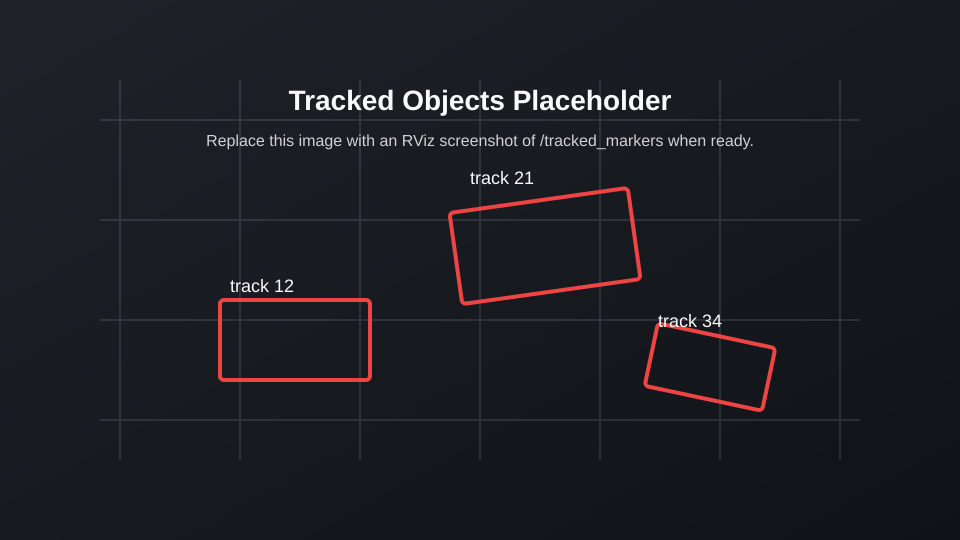

# ROS2 C++ Perception And Tracking Mini-Stack

This repository is a ROS2 C++ autonomous-driving mini-stack built around KITTI replay.

The active stack is centered on:

- `lidar_processing` for LiDAR 3D detections
- `camera_processing` for stereo-camera 3D detections
- `ekf_multi_object_tracker` in `fusion_core` for map-frame multi-object tracking
- `visualization` for stack bringup and RViz

`ekf_multi_object_tracker` is the main fusion and tracking node now. It is functional and used by the default bringup, but it is still under active tuning and refinement.

## Current Visuals

LiDAR preprocessing and 3D proposal extraction:


Stereo-camera detections:


Tracked-object visualization:



## Active Pipeline

`KITTI replay -> /lidar_pc -> lidar_processing -> /lidar_detections + /lidar_detection_markers`

`KITTI replay -> stereo images -> camera_processing -> /camera_stereo_detections + /camera_stereo_detection_markers`

`/lidar_detections + /camera_stereo_detections -> ekf_multi_object_tracker -> /tracked_objects + /tracked_markers`

## Current Outputs

- `/tracked_objects`
- `/tracked_markers`
- `/lidar_detection_markers`
- `/camera_stereo_detection_markers`

## Current Status

Implemented:

- LiDAR preprocessing, clustering, and 3D detection publishing
- stereo-camera 3D detection publishing
- centralized EKF-based multi-object tracking in `map`
- LiDAR-led object footprint tracking with stereo position support
- RViz marker outputs for detections and tracked objects
- stack-level bringup using the EKF tracker by default

Still under work:

- tracker tuning for stability and lifecycle behavior
- parameter refinement for static-scene performance
- broader automated test coverage
- downstream behavior or decision outputs

## Quick Start

Build:

```bash
colcon build --packages-select auto_stack_msgs lidar_processing camera_processing fusion_core visualization
source install/setup.bash
```

Launch:

```bash
ros2 launch visualization av_stack_bringup.launch.py \
  dataset_path:=/path/to/kitti_dataset \
  dataset_number:=0
```

Launch with RViz:

```bash
ros2 launch visualization av_stack_bringup.launch.py \
  dataset_path:=/path/to/kitti_dataset \
  dataset_number:=0 \
  launch_rviz:=true
```

Enable sensor-side CSV profiling logs:

```bash
ros2 launch visualization av_stack_bringup.launch.py \
  dataset_path:=/path/to/kitti_dataset \
  dataset_number:=0 \
  enable_camera_csv_logging:=true \
  enable_lidar_csv_logging:=true
```

## Package Overview

Custom packages:

- `lidar_processing`
- `camera_processing`
- `fusion_core`
- `visualization`

Integrated infrastructure:

- `ros2_kitti_core`
- `ros2_kitti_replay`
- `ros2_kitti_description`
- `ros2_kitti_msgs`
- `ros2_kitti_odom`
- `ros2_kitti_odom_kiss_icp`
- `ros2_kitti_odom_open3d`
- `ros2_kitti_rviz_plugin`

## Documentation

- [docs/stack_details.md](/home/asfy/projects/covolv/ros2_av_stack_cpp/docs/stack_details.md)
- [docs/ekf_tracker_validation.md](/home/asfy/projects/covolv/ros2_av_stack_cpp/docs/ekf_tracker_validation.md)

## Attribution

This project builds on and integrates the `ros2_kitti_*` replay and visualization stack from:

- `tengfoonglam/kitti_odometry_replayer_ros2`
- https://github.com/tengfoonglam/kitti_odometry_replayer_ros2
